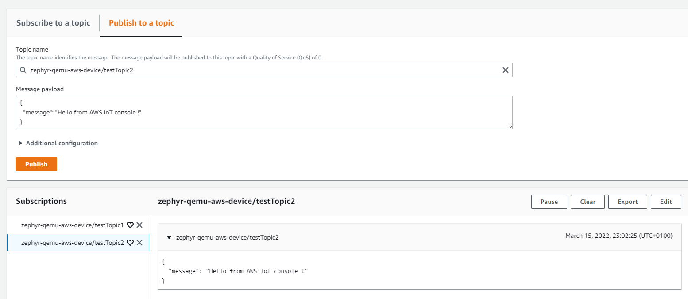

# AWS

## Ressources

- [AWS : MQTT](https://docs.aws.amazon.com/fr_fr/iot/latest/developerguide/mqtt.html)
- [Zephyr RTOS : MQTT](https://docs.zephyrproject.org/latest/reference/networking/mqtt.html)
- [AWS : MQTT test client](https://console.aws.amazon.com/iot/home?region=us-east-1#/test)
- [AWS devices list](https://us-east-1.console.aws.amazon.com/iot/home?region=us-east-1#/thinghub)
  - [`zephyr-qemu-aws-device`](https://us-east-1.console.aws.amazon.com/iot/home?region=us-east-1#/thing/zephyr-qemu-aws-device  )
Secondary :
- [Designing MQTT Topics for AWS IoT Core](https://docs.aws.amazon.com/whitepapers/latest/designing-mqtt-topics-aws-iot-core/designing-mqtt-topics-aws-iot-core.html)
    - Especially [MQTT design best practices](https://docs.aws.amazon.com/whitepapers/latest/designing-mqtt-topics-aws-iot-core/mqtt-design-best-practices.html)
      - `Using the MQTT topics for commands` and `MQTT command payload syntax`, use a `session-id` to identify the command


# Device information

- Device : `zephyr-qemu-aws-device`
- Endpoint : `a31gokdeokxhl8-ats.iot.us-east-1.amazonaws.com`
- [Public certificate](./certs/165a24f1ae6f9a2223b991f158c46e0518d83bca7b5bb62c37ba6a2454066d2e-certificate.pem.crt) : 
    `./certs/165a24f1ae6f9a2223b991f158c46e0518d83bca7b5bb62c37ba6a2454066d2e-certificate.pem.crt`
- [Private key certificate](./certs/165a24f1ae6f9a2223b991f158c46e0518d83bca7b5bb62c37ba6a2454066d2e-private.pem.key)
    `./certs/165a24f1ae6f9a2223b991f158c46e0518d83bca7b5bb62c37ba6a2454066d2e-private.pem.key`
- [RSA Amazon Root CA certificate](./certs/AmazonRootCA1.pem)
    `./certs/AmazonRootCA1.pem`
- [ECC Amazon Root CA certificate](./certs/AmazonRootCA3.pem)
    `./certs/AmazonRootCA3.pem`

## Prerequisites

- MBEDTLS :
  - Min heap : 32k
- Updated timestamp (SNTP)
- IPv4 addr

## Expected output

Let's suppose device name is `zephyr-qemu-aws-device`

- Configure device `CONFIG_CLOUD_AWS_DEVICE_NAME="zephyr-qemu-aws-device"` in `prj.conf`
- Subscribe to topics : `zephyr-qemu-aws-device/testTopic1` and `zephyr-qemu-aws-device/testTopic2`
- Send MQTT messages to topic `zephyr-qemu-aws-device/testTopic2`



```
-- west build: running target run
[0/1] To exit from QEMU enter: 'CTRL+a, x'[QEMU] CPU: qemu32,+nx,+pae
SeaBIOS (version zephyr-v1.0.0-0-g31d4e0e-dirty-20200714_234759-fv-az50-zephyr)
Booting from ROM..*** Booting Zephyr OS build zephyr-v2.7.1  ***


[00:00:00.110,000] <inf> net_config: IPv6 address: 2001:db8::1
[00:00:00.110,000] <inf> net_config: IPv6 address: 2001:db8::1
<inf> aws_client: UTC time : 2022/03/15 22:01:56
<inf> aws_client: MQTT 1357888 connected !
<inf> aws_client: Client: 14b840, event type: 0 [ MQTT_EVT_CONNACK ]
<inf> aws_client: Subscribing to 2 topics
<inf> aws_client: Client: 14b840, event type: 7 [ MQTT_EVT_SUBACK ]
<inf> aws_client: Subscription acknowledged 1
<inf> aws_client: Client: 14b840, event type: 2 [ MQTT_EVT_PUBLISH ]
<inf> aws_client: Received 47 B long message on topic zephyr-qemu-aws-device/testTopic1
<inf> aws_client: Received message
                  7b 0a 20 20 22 6d 65 73  73 61 67 65 22 3a 20 22 |{.  "mes sage": "
                  48 65 6c 6c 6f 20 66 72  6f 6d 20 41 57 53 20 49 |Hello fr om AWS I
                  6f 54 20 63 6f 6e 73 6f  6c 65 20 21 22 0a 7d    |oT conso le !".} 
<inf> aws_client: Client: 14b840, event type: 9 [ MQTT_EVT_PINGRESP ]
<inf> aws_client: Client: 14b840, event type: 2 [ MQTT_EVT_PUBLISH ]
<inf> aws_client: Received 47 B long message on topic zephyr-qemu-aws-device/testTopic2
<inf> aws_client: Received message
                  7b 0a 20 20 22 6d 65 73  73 61 67 65 22 3a 20 22 |{.  "mes sage": "
                  48 65 6c 6c 6f 20 66 72  6f 6d 20 41 57 53 20 49 |Hello fr om AWS I
                  6f 54 20 63 6f 6e 73 6f  6c 65 20 21 22 0a 7d    |oT conso le !".}
```