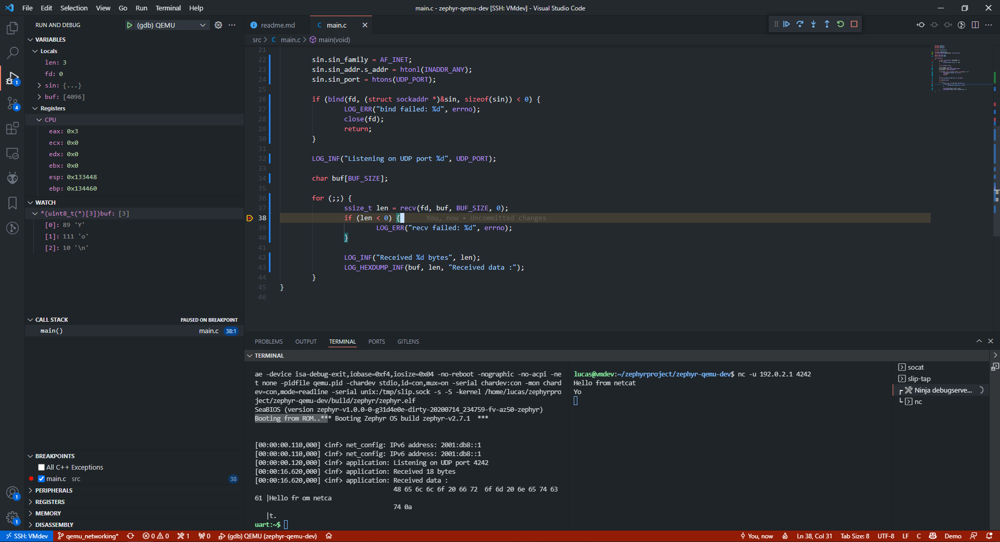

# Zephyr RTOS and QEMU emulator

## Ressources :

- [Zephyr CMake Package - Zephyr Build Configuration CMake package](https://docs.zephyrproject.org/latest/guides/zephyr_cmake_package.html#cmake-build-config-package)
- [Application Development](https://docs.zephyrproject.org/latest/application/index.html)
- [Zephyr Example Application](https://github.com/zephyrproject-rtos/example-application)
- [Build and Configuration Systems - Build System (CMake)](https://docs.zephyrproject.org/latest/guides/build/index.html#cmake-details)
- [VS Code integration #21119](https://github.com/zephyrproject-rtos/zephyr/issues/21119)
- [West (Zephyr’s meta-tool)](https://docs.zephyrproject.org/latest/guides/west/index.html)
- [West Manifests](https://docs.zephyrproject.org/latest/guides/west/manifest.html)
- [Moving to West¶](https://docs.zephyrproject.org/latest/guides/west/moving-to-west.html)
- [Workspaces](https://docs.zephyrproject.org/latest/guides/west/workspaces.html)
  - [T2: Star topology, application is the manifest repository](https://docs.zephyrproject.org/latest/guides/west/workspaces.html#west-t2)
- [Zephyr RTOS Development in Linux](https://github.com/bus710/zephyr-rtos-development-in-linux)
- [All Configuration Options](https://docs.zephyrproject.org/2.6.0/reference/kconfig/index-all.html)
- [VS Code - Variables Reference](https://code.visualstudio.com/docs/editor/variables-reference)
- [QEMU wiki](https://wiki.qemu.org/Main_Page)
- [GDB: The GNU Project Debugger](https://www.sourceware.org/gdb/)
- [VS Code - Debugging](https://code.visualstudio.com/docs/editor/debugging)

## Import this project using west

```
west init -m https://github.com/lucasdietrich/zephyr-qemu-dev --mr main my-workspace
```

## Build

Open tasks panel with `Ctrl + Maj + B`

## Debug

Launch `Ninja debugserver` task and press `F5`

## Networking

In order to run/debug the networking application

- Run `../net-tools/loop-socat.sh`
- Run `sudo ../net-tools/loop-slip-tap.sh`

And keep the consoles over sessions

Run or debug the application normally

## Run : Expected output



## Known issues

- If previous ninja process still listenning to the serial port 1234, find it with `sudo netstat -anpe | grep "1234" | grep "LISTEN"` or `sudo lsof -i :1234` and kill it.

- `preLaunchTask` is not working in `launch.json`

- Don't forget to activate python `venv` if using `west`

- Clean `build` folder if strange error appear

- If closing `loop-slip-tap.sh` by error, kill processes locking the fd using `sudo lsof | grep slip` and relaunch